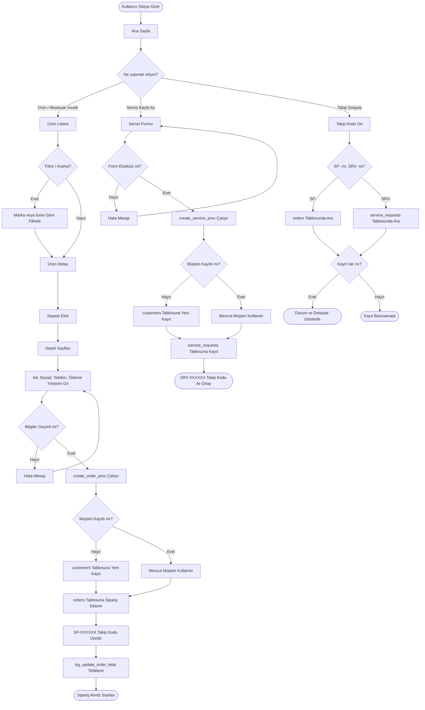
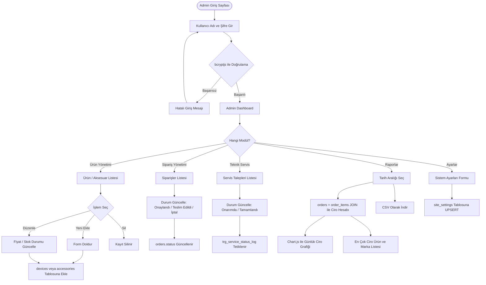
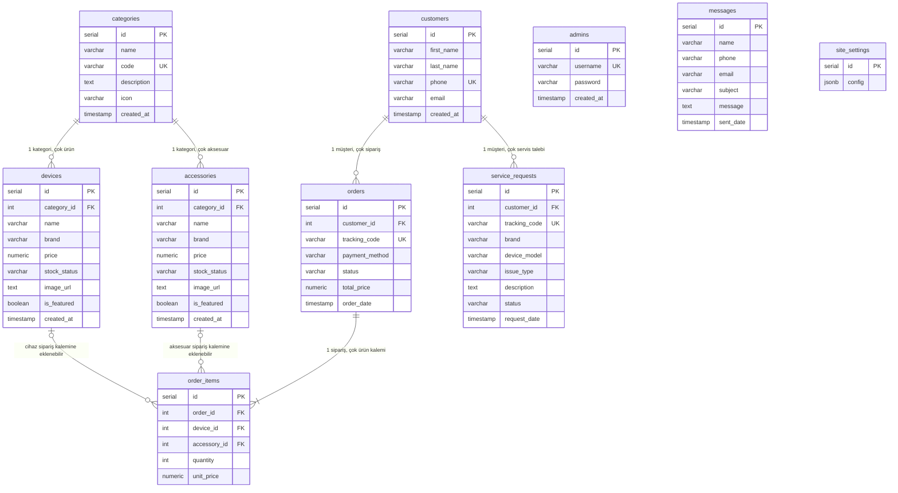

# Telefon Bayisi Projesi

Bu proje, bir telefon bayisinin günlük işlerini (sipariş alma, teknik servis takibi, stok yönetimi ve iletişim) web üzerinden yürütebilmesi için geliştirilmiştir. **TBL331: Veritabanı Yönetim Sistemleri** dersi dönem projesi olarak hazırlanmıştır ve arka planda **PostgreSQL** veritabanı kullanmaktadır.

## 1. Problem Tanımı

Küçük telefon bayilerinde stok takibi, müşteri siparişleri ve teknik servis süreçleri çoğunlukla kâğıt üzerinde veya excel tablolarıyla yürütülüyor. Bu da ciddi sorunlara yol açıyor: hangi ürünün ne kadar kaldığını anlık göremiyorsunuz, müşteri cihazının servis durumunu takip etmek zorlaşıyor, ciro hesabı yapmak için saatler harcıyorsunuz.

Bu projeyle yukarıdaki sorunları çözmeye çalıştık. Müşteriler ürünleri listeleyip sipariş verebiliyor, teknik servis talebi açabiliyor ve takip kodu ile servis durumunu sorgulayabiliyor. Yönetici tarafında ise tüm süreçler tek panel üzerinden yönetilabiliyor.

## 2. Yapılan Araştırmalar

Proje boyunca birkaç teknik konuda araştırma yapmamız gerekti:

* **Normalizasyon ve tablo tasarımı:** Hangi verilerin hangi tabloda tutulacağına karar verirken hayli araştırma yaptık. PK, FK, UNIQUE ve CHECK kısıtlarını eklerken PostgreSQL dökümantasyonundan çok faydalandık.

* **Stored Procedure (PL/pgSQL):** Müşteri kaydı, sipariş oluşturma ve stok güncellemenin aynı anda gerçekleşmesini istiyorduk; bunun için `create_order_proc` ve `create_service_proc` prosedürlerini yazdık. `CALL` komutuyla nasıl çağrılacağını anlamak biraz zaman aldı.

* **Trigger:** Sipariş kalemleri eklenince `orders.total_price` alanının otomatik güncellenmesini sağlayan `trg_update_order_total` tetikleyicisini ekledik. Bir de servis durumu değişince log oluşturan `trg_service_status_log` var.

* **Oturum ve şifre güvenliği:** Admin paneli için `express-session` ile oturum yönetimi kuruldu. Şifreler `bcryptjs` ile hashlenip veritabanına kaydediliyor.

* **Raporlama:** orders ve order_items tablolarını JOIN ile birleştirip GROUP BY ile günlük/dönemsel ciro hesapladık. Sonuçları **Chart.js** ile grafik olarak gösterdik.

## 3. Akış Şeması

### 3.1 Müşteri Akış Şeması



### 3.2 Yönetici (Admin) Akış Şeması



## 4. Yazılım Mimarisi

Projeyi MVC (Model-View-Controller) yapısına göre kurguladık.

* **View (Görünüm):** `views/` klasöründeki EJS şablonları. Kullanıcı arayüzü özel CSS ile yapıldı, karanlık tema ağırlıklı bir tasarım benimsedik. Sepet localStorage'da tutuluyor, grafikler Chart.js ile çiziliyor.

* **Controller (Denetleyici):** `app.js` dosyasındaki Express route'ları. HTTP isteklerini karşılar, iş mantığını çalıştırır, veritabanıyla konuşur. Admin oturumları express-session, şifreler bcryptjs ile yönetiliyor.

* **Model (Veritabanı):** PostgreSQL tarafında 10 tablo, 2 stored procedure ve 2 trigger. Node.js ile bağlantı `pg` (node-postgres) kütüphanesi üzerinden `db.js` dosyası aracılığıyla sağlanıyor.

## 5. Veri Tabanı Diyagramı (ER Diyagramı)



## 6. Genel Yapı

1. **Admin Girişi:** `/admin/login` üzerinden bcryptjs ile şifre doğrulaması yapılıyor. Başarılı girişte express-session ile oturum açılıyor. Admin sayfaları oturum kontrolü middleware'i ile korunuyor.

2. **Ürün Kataloğu ve Sepet:** Müşteriler telefon ve aksesuar listelerini görebiliyor, localStorage tabanlı sepete ürün ekleyebilip sipariş formuyla tamamlayabiliyor.

3. **Sipariş Yönetimi:** `create_order_proc` stored procedure'ü üzerinden yeni müşteri + sipariş + SP-XXXXXX takip kodu tek seferde oluşturuluyor. `trg_update_order_total` tetikleyicisi sipariş toplamını otomatik hesaplıyor.

4. **Teknik Servis:** `create_service_proc` prosedürüyle SRV-XXXXXX takip kodlu servis talepleri açılıyor. Müşteri `/sorgula` sayfasından güncel durumu takip edebiliyor.

5. **Raporlama:** Admin panelinde orders + order_items JOIN'i ile günlük/dönemsel ciro hesaplanıyor, Chart.js ile grafiğe dökülüyor, CSV olarak indirilebiliyor.

6. **İletişim Mesajları:** Müşterilerden gelen mesajlar `messages` tablosuna kaydediliyor ve admin panelinden okunabiliyor.

## 7. Kurulum

1. **Gereksinimler:** Node.js (v18+) ve PostgreSQL (v14+) kurulu olmalı.

2. **Paket kurulumu:**
   ```bash
   npm install
   ```

3. **Çevre değişkenleri:** Kök dizine `.env` dosyası oluşturun:
   ```env
   DB_USER=postgres
   DB_PASSWORD=veritabani_sifreniz
   DB_HOST=localhost
   DB_PORT=5432
   DB_NAME=telefon_bayisi
   SESSION_SECRET=oturum_gizli_anahtari
   ```

4. **Veritabanı:** PostgreSQL'de `telefon_bayisi` adında veritabanı oluşturun ve `database.sql` dosyasını çalıştırın.

5. **Uygulamayı başlatma:**
   ```bash
   npm run dev
   ```

6. **Erişim:** `http://localhost:8080` — Admin girişi: kullanıcı adı `admin`, şifre `admin`

## 8. Referanslar

1. Node.js dökümantasyonu: https://nodejs.org
2. Express.js: https://expressjs.com
3. PostgreSQL PL/pgSQL: https://www.postgresql.org/docs/current/plpgsql.html
4. MDN Web Docs: https://developer.mozilla.org
5. Chart.js: https://www.chartjs.org
6. bcryptjs: https://github.com/dcodeIO/bcrypt.js
7. node-postgres: https://node-postgres.com