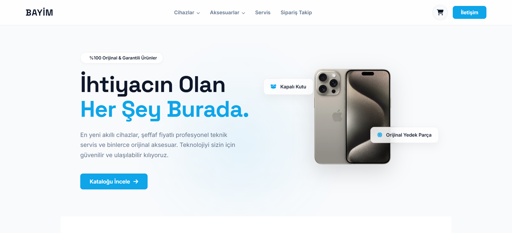
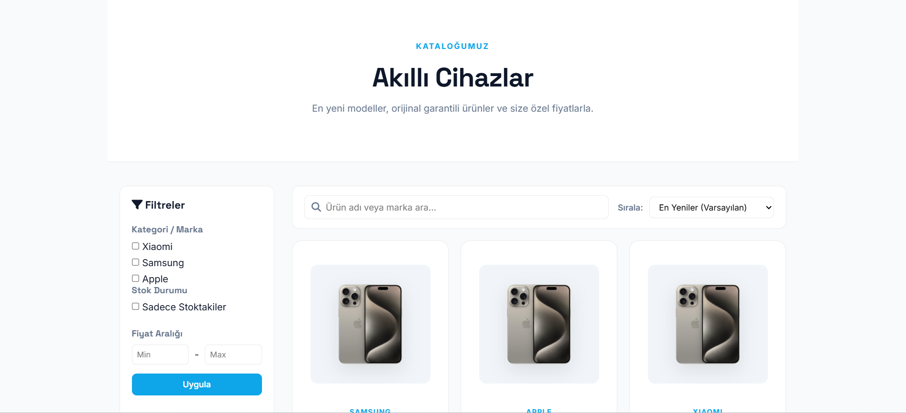
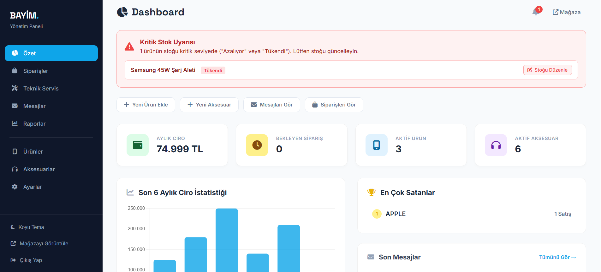
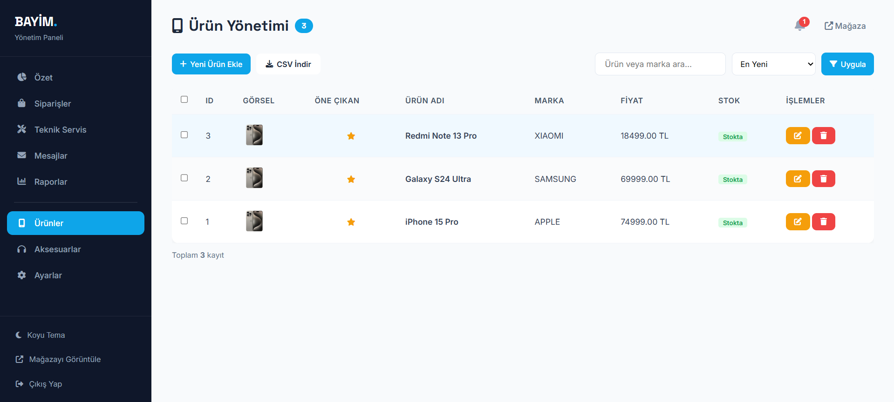

# Telefon Bayisi - Satış ve Teknik Servis Otomasyonu

## 1. Proje Özeti
* Bu proje, bir telefon bayisinin günlük işlemlerini yönetmek için geliştirilmiş web tabanlı bir otomasyon sistemidir.
* Müşteriler mağazadaki cihazları ve aksesuarları inceleyebilir, sepetlerine ekleyip mağazadan teslim almak üzere ayırtabilirler.
* Müşteriler kendi takip kodları (Örn: SRV-123456) ile teknik servis süreçlerini anlık olarak sistem üzerinden sorgulayabilirler.
* Yönetici (Admin) paneli üzerinden ürün stokları, sipariş (ayırtma) onayları, müşteri mesajları ve teknik servis durumları yönetilebilir.
* Proje, Veritabanı Yönetim Sistemleri (VTYS) dersi kapsamında ilişkisel veritabanı kurallarına ve kısıtlamalarına uygun olarak tasarlanmıştır.

## 2. Geliştirme Ortamı
* **Kullanılan Dil / Platform:** JavaScript, Node.js
* **Backend Framework:** Express.js
* **Frontend (Arayüz):** EJS (Şablon Motoru), HTML5, CSS3
* **Veritabanı:** PostgreSQL (pg kütüphanesi kullanılarak)
* **Temel Kütüphaneler:** `express`, `express-session`, `pg`, `bcryptjs`, `dotenv`, `ejs`

## 3. Projenin Yüklenmesi ve Çalışır Hale Getirilmesi
* Bilgisayarınızda Node.js ve PostgreSQL kurulu olmalıdır.
* Komut İstemcisi (Terminal) üzerinden projenin bulunduğu klasöre gidin.
* Gerekli paketleri ve bağımlılıkları indirmek için şu komutu çalıştırın:
  `npm install`
* Projenin ana klasöründe `.env` adında yeni bir dosya oluşturun ve içerisine kendi veritabanı ayarlarınızı şu şekilde girin:
  ```env
  DB_USER=postgres
  DB_PASSWORD=veritabani_sifreniz
  DB_HOST=localhost
  DB_PORT=5432
  DB_NAME=telefon_bayisi
  SESSION_SECRET=gizli_anahtar_123
  ```
* Veritabanı tablolarının oluşturulması için, PostgreSQL arayüzünden (örneğin pgAdmin) `telefon_bayisi` adında bir veritabanı oluşturun ve içerisine `database.sql` dosyasındaki kodları kopyalayarak çalıştırın.
* Projeyi başlatmak için terminale şu komutu yazın:
  `npm run dev`
* Tarayıcınızı açın ve adres çubuğuna `http://localhost:8080` yazarak projeyi görüntüleyin.

## 4. Geliştirilen Arayüzün Örnek Görseli




